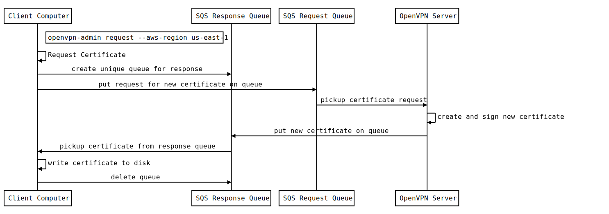
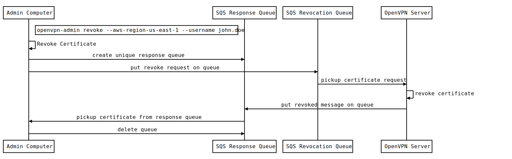

# openvpn-admin

This module contains a command-line utility that allows users to request new certificates, administrators to revoke 
certificates and the OpenVPN server to process those requests.

## How do you use this module?

#### Examples

```
$ openvpn-admin request --aws-region us-east-1
$ openvpn-admin revoke --aws-region us-east-1 --username john.doe
$ openvpn-admin process-requests --aws-region us-east-1
$ openvpn-admin process-revokes --aws-region us-east-1
```
#### Install openvpn-admin on your servers

`openvpn-admin` consists of a single binary. The easiest way to get it onto your servers is to use the [Gruntwork
Installer](https://github.com/gruntwork-io/gruntwork-installer):

```
gruntwork-install --binary-name openvpn-admin --repo https://github.com/gruntwork-io/package-openvpn --tag v0.5.4
```

Alternatively, you can download the binary from the [Releases
Page](https://github.com/gruntwork-io/package-openvpn/releases).


#### Commandline Options
There are several sub-commands and switches that control the behavior of this utility.  

|Command|Description|
|--------------------|-----------------------------------|
|request|Requests a new OpenVPN configuration from the server and writes it locally to disk as _username_.ovpn|
|revoke|Revokes a user's certificate so that they may no longer connect to the OpenVPN server|
|process-requests|A server-side process to respond to requests by generating a new user certificate request, signing it, generating a new OpenVPN configuration file and returning it to the requestor.
|process-revokes|A server-side process to respond to revocation requests by revoking the user's valid certificate

|Option|Description|Required|Default|
|--------------------|----------------|------------|------------|
|--debug             |Enable verbose logging to the console|Optional|
|--aws-region        |The region OpenVPN is installed in |request, revoke, process-requests, process-revokes||
|--username          |The name of the user you are making a certificate request or revocation request for.|revoke (required). request (optional)|IAM username (request command)|
|--request-url       |The url for the SQS queue used for making OpenVPN configuration (certificate) requests|Optional|finds url automatically|
|--revoke-url        |The url for the SQS queue used for making revocation requests|Optional|find url automatically|

##### Permissions
- Users requesting a new OpenVPN request must be a member of the `OpenVPNUsers` IAM group. 
- Users requesting a certificate revocation must a member of the `OpenVPNAdmins` IAM group.

## New Certificate Request Workflow


## Revoke Certificate Workflow


